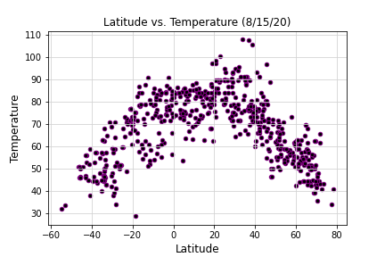
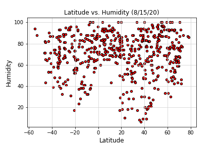
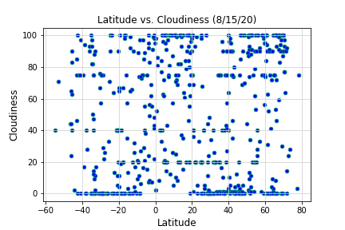
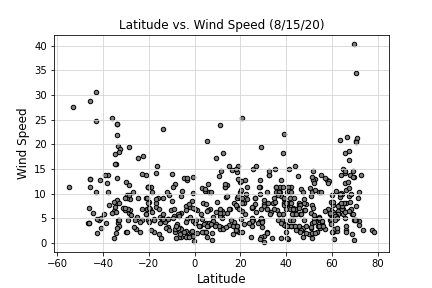

# Python api

## Background

This python notebook explores the question: "What's the weather like as we approach the equator?" Even though we know the answer, this data consists of graphs and charts to show some evidence. 

## Part I - WeatherPy

Python script is used to visualize the weather of 500+ cities across the world of varying distance from the equator. To accomplish this, the [simple Python library](https://pypi.python.org/pypi/citipy), the [OpenWeatherMap API](https://openweathermap.org/api), and a little common sense are used to create a representative model of weather across world cities.

### Scatter Plots - Temperature vs. X
A series of scatter plots were created to showcase the following relationships:

* Temperature (F) vs. Latitude
  
  

* Humidity (%) vs. Latitude

  

* Cloudiness (%) vs. Latitude

  

* Wind Speed (mph) vs. Latitude

  

Summary analysis of each plot can be found after each plot in the notebook.

### Linear Regression - Northern vs. Southern Hemisphere
Plots showing linear regression of each relationship were created only this time separating them into Northern Hemisphere (greater than or equal to 0 degrees latitude) and Southern Hemisphere (less than 0 degrees latitude). Each of the following plots, along with the written analysis of each can be found in the notebook.

* Northern Hemisphere - Temperature (F) vs. Latitude
* Southern Hemisphere - Temperature (F) vs. Latitude
* Northern Hemisphere - Humidity (%) vs. Latitude
* Southern Hemisphere - Humidity (%) vs. Latitude
* Northern Hemisphere - Cloudiness (%) vs. Latitude
* Southern Hemisphere - Cloudiness (%) vs. Latitude
* Northern Hemisphere - Wind Speed (mph) vs. Latitude
* Southern Hemisphere - Wind Speed (mph) vs. Latitude

### Weather Check - using API calls
* Randomly select 500 unique (non-repeat) cities based on latitude and longitude.
* Performed a weather check on each of the cities using a series of successive API calls.
* Included a print log of each city as it's being processed with the city number and city name.
* Saved a CSV of all retrieved data and a PNG image for each scatter plot.

# Part II - VacationPy

Using jupyter-gmaps and the Google Places API data will be used to plan a ficticious vacation.

* A heat map was created that displays the humidity for every city from WeatherPy.

  

* The DataFrame was narrowed down to find (my) ideal weather condition. For example:

  * A max temperature lower than 75 degrees but higher than 60.

  * Hummidity less than 40.

* Using Google Places API, hotels within the range of criteria are plotted on a heatmap with markers.

  

### Copyright

Trilogy Education Services © 2019. All Rights Reserved.
